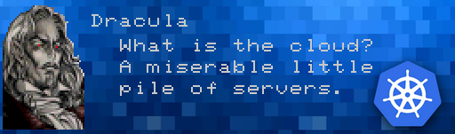

 

- [Stevey's Google Platforms Rant](https://gist.github.com/chitchcock/1281611)
- [Notes on Distributed Systems for Young Bloods](https://www.somethingsimilar.com/2013/01/14/notes-on-distributed-systems-for-young-bloods/)

<!-- -->
